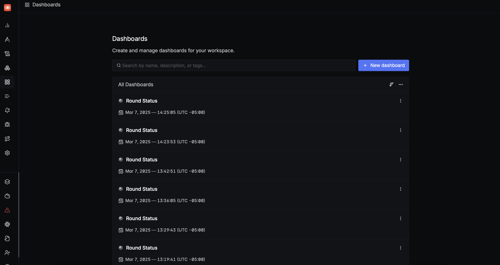

# Example Competition Server

## Changelog

All notable changes to the competition-test-api docker container will be noted here.

### v1.1-rc6 - 2025-03-26

#### Fixed

- Fixed incorrect directory naming for fuzz-tooling
- Fixed crash detection for java projects

### v1.1-rc5 - 2025-03-25

#### Fixed

- Fixed server error caused during a bundle submission

### v1.1-rc4 - 2025-03-21

#### Added

- **_BREAKING CHANGE_**: Added the `teams.crs.taskme` field in the scantron.yaml. This **MUST** be set to `true` if you want the competition server to send tasks to your CRS.
- Added ability to optionally use SCANTRON_GITHUB_PAT environment variable rather than the `github.pat` field in scantron.yaml

#### Fixed

- Fixed lack of a check for the dynamic-stack-buffer-overflow caused by example-libpng's address fuzzer
- Fixed race condition when reproducing more than one POV submission

### v1.1-rc3 - 2025-03-18

#### Added

- Added now required `api_host_and_port` scantron.yaml field to split the role of `listen_address`. This reverses the change made in v1.1-rc2 where `listen_address` was used to generate source tarball URLs and also used
  as the server's bind address. Now, `api_host_and_port` is used by the server when sending source tarballs to the CRSs, and `listen_address` is the address the server binds to.

### v1.1-rc2 - 2025-03-17

#### Fixed

- Fixed issue where competition server hardcoded `localhost` into the URLs for the source tarballs sent by the server during tasking. Now the `listen_address` field in scantron.yaml is used.

### v1.1-rc1 - 2025-03-14

Initial release candidate.

## Overview

This folder allows users to run a full end-to-end competition server, as well as a signoz endpoint for which competitors may submit telemetry to for testing.
This server simulates how the actual server will act in the competition. This means:

- The example server supports the v1.1 competition server API, including endpoints for patches/POVs/sarif submissions, as well as endpoints for checking the patch/POV statuses.
- As a correlary, the server also supports the v1.1 CRS API, meaning it can send tasks to CRSs
- The `compose.yaml` given in this folder also brings up signoz for telemetry. Competitors may use this to send to telemetry to, much like how they would in a real competition round.

## Prerequisites

You must make changes to the following files in order for the server to run properly

### GitHub Container Registry

You must login to the GitHub Container Registry to access the example competition server container.

You will need to have a GitHub personal access token (PAT) scoped to at least `read:packages`.

To create the PAT, go to your account, `Settings` > `Developer settings` > `Personal access tokens`, and generate a Token (classic) with the scopes needed for your use case.

For this example, the `read:packages` scope is required. If you'd like, you may also enable the `repo` scope so you can use the same token for the container registry and the competition test server (see the [scantron.yaml](#scantronyaml)
section below).

Once you have your PAT, set it to an environment variable on your machine like this

```bash
export CR_PAT=YOUR_TOKEN_HERE
```

Finally, you must login to the registry, like so:

```bash
$ echo $CR_PAT | docker login ghcr.io -u USERNAME --password-stdin
> Login Succeeded
```

To check if it succeeded, try running the following:

```bash
docker pull --platform=linux/amd64 ghcr.io/aixcc-finals/example-crs-architecture/competition-test-api:v1.1-rc6
```

Docker will store your credentials in your OS's native keystore, so you should only have to run `docker login` on subsequent logins into the GitHub Container Repository

### `scantron.yaml`

The competition servers configuration is stored in the `scantron.yaml` file. Of note for competitors
would be the following:

- `api_keys.id`: You don't need to edit this, but this is the key the CRS must use to send submissions to the server
- `crs`: This stores information the competition server uses to access the CRS
- `github.pat`: The server must download fuzz tooling and challenge repositories from GitHub, so you must add a GitHub personal access token with repository read access here in order for the server to work. This token
  must have the `repo` scope. You may use the same access token that you used for container registry, just as long as it has both the `repo` scope and the `read:packages` scope enabled. You may also set this value
  through the environment variable `SCANTRON_GITHUB_PAT` within the scantron service.
- `api_host_and_port`: This should be set to whatever host and port your CRS is using to send submissions to.
- `teams.crs.taskme`: New as of rc4 is the `taskme` flag. You must set this to true if you want the competition server to send tasks to your CRS.

### `signoz/otel-collector-config.yaml`

In order to test data submission to signoz, you can edit the Basic Auth username and password here, under `basicauth/server.htpasswd.inline`

In order to use this signoz from your CRS, use the following environment vars:

```bash
OTEL_EXPORTER_OTLP_HEADERS="Authorization=Basic <base64 encoded credentials in format username:password>"
OTEL_EXPORTER_OTLP_ENDPOINT="http://127.0.0.1:4317" # This will be the Team-specific telemetry server configured by the Organizers.
OTEL_EXPORTER_OTLP_PROTOCOL=grpc
```

## Running the server

You can run the server and signoz by doing `docker compose up` from within the example-competition-server directory.
If you wish to not run signoz, you can remove the `include` statement at the top of the compose.yaml in example-competition-server. NOTE: Signoz may take 2-5 minutes to fully start up.

Through the Docker compose option, the server is available by default through `http://localhost:1324`. It's also available through `http://scantron:1324` within the `endpoint-network` Docker network. This Docker network
is made available for teams who have their CRS within their own compose setup. An example of a webservice that uses this network is shown in the example-crs-webservice
[compose.yaml](https://github.com/aixcc-finals/example-crs-architecture/blob/main/example-crs-webservice/compose.yaml).

Alternatively, you may start the server directly with the command below.

```bash
docker run \
    -v /var/run/docker.sock:/var/run/docker.sock \ # required for Docker-out-of-docker stuff
    -v path/to/scantron.yaml:/etc/scantron/scantron.yaml \ # required for server configuration
    -v path/to/scantron.db:/app/scantron.db \ # optional, in case you may have a sqlite3 database from a previous run you want to use again
    -v /tmp:/tmp \ # required, since it removes a strange bug caused by us doing Docker-out-of-docker
    -p 1323:1323 \
    -it \
    --rm \
    --privileged \ # required, for Docker-out-of-docker
    --add-host=host.docker.internal:host-gateway \
    ghcr.io/aixcc-finals/example-crs-architecture/competition-test-api:v1.1-rc6 server
```

In the normal competition, the server would get a notification from GitHub via GitHub webhooks, and would fire off a task to
the CRS from there. The example server here responds to an HTTP request instead. Here is an example curl command to
trigger a full scan.

```bash
curl -X 'POST' 'http://localhost:1323/webhook/trigger_task' -H 'Content-Type: application/json' -d '{
    "challenge_repo_url": "git@github.com:aixcc-finals/example-libpng.git",
    "challenge_repo_head_ref": "92407e9d102e36f5538dea21ca87b0dc27817126",
    "fuzz_tooling_url": "https://github.com/aixcc-finals/oss-fuzz-aixcc.git",
    "fuzz_tooling_ref": "d5fbd68fca66e6fa4f05899170d24e572b01853d",
    "fuzz_tooling_project_name": "libpng",
    "duration": 3600
}'
```

Here is an example for a delta scan:

```bash
curl -X 'POST' 'http://localhost:1323/webhook/trigger_task' -H 'Content-Type: application/json' -d '{
    "challenge_repo_url": "git@github.com:aixcc-finals/example-libpng.git",
    "challenge_repo_base_ref": "0cc367aaeaac3f888f255cee5d394968996f736e",
    "challenge_repo_head_ref": "92407e9d102e36f5538dea21ca87b0dc27817126",
    "fuzz_tooling_url": "https://github.com/aixcc-finals/oss-fuzz-aixcc.git",
    "fuzz_tooling_ref": "d5fbd68fca66e6fa4f05899170d24e572b01853d",
    "fuzz_tooling_project_name": "libpng",
    "duration": 3600
}'
```

Note: The Git repository specified in the curl command must have a shell script located at `.aixcc/test.sh`. This script is used to perform functionality tests on patches submitted to the competition API. This script
should have a 0 exit code on success, and a non-zero exit code on failure.

## Viewing Signoz Dashboard

Once you kick off a task, you will be able to view the competition dashboard. Go to `localhost:3301`.
There you will see a login screen, or a screen to create your account. Once you login you'll be met
with this screen.


Click on the Dashboards menu entry on the left-hand side.



Click on one of the Round Status dashboards (doesn't matter which one). Then, set the `$Round`
and the $Environment`. You should see an image similar to below.


